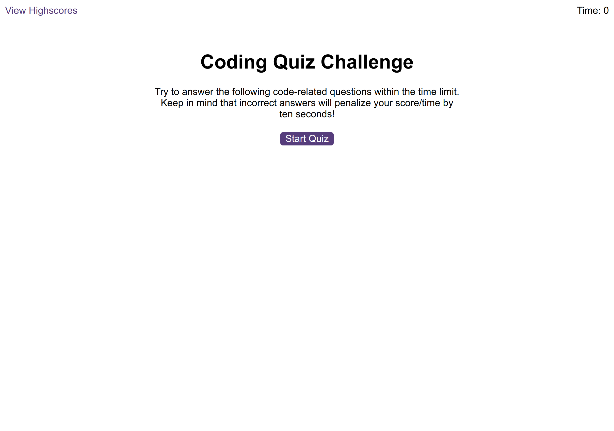

# Code quiz

This is a coding quiz app. It poses 5 coding questions focused on JavaScript which you have to answer within 75 seconds. You will be penalized for every wrong answer. Your remaining time at the end of the quiz will be your final score which you can record as a high score on your local device.

## Screenshot

## Webpage link

https://yrezvani.github.io/code-quiz/
